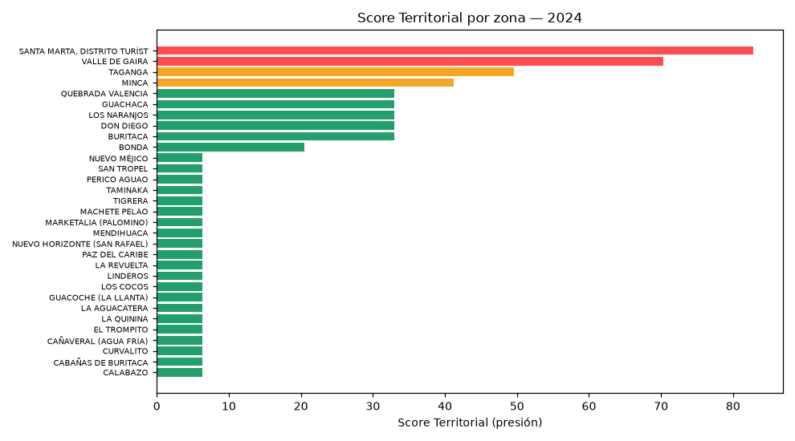

# ADN Sostenible — Sistema de Inteligencia Predictiva de Turismo Sostenible

**Concurso Datos al Ecosistema 2026: IA para Colombia** · Nivel **Avanzado**
Categoría: *Sostenibilidad y medio ambiente* / *Cultura y Turismo*

---

## 🎯 El problema

Los municipios turísticos de Colombia no pueden **anticipar ni dimensionar los efectos
colaterales del turismo**. Saben cuántos visitantes llegan, pero no cuánta presión ejerce
esa actividad sobre los residuos, los servicios públicos, la salud o el tejido social —y
mucho menos **en qué zona concreta** del territorio.

Sin esa información, las decisiones de política turística se toman a ciegas: no se sabe
dónde intervenir primero, ni si el modelo turístico vigente está mejorando o degradando el
destino.

## 💡 La solución

Un **sistema de inteligencia territorial** que calcula, para cada una de las **31 zonas** del
Distrito de Santa Marta, un **Score Territorial de presión turística**, e identifica dónde y
por qué se requiere intervención pública.

**Arquitectura híbrida de IA:**

```
Datos abiertos → XGBoost → Score Territorial → Llama 4 → Recomendaciones de política pública
   (20 vars)     (diagnóstico cuantitativo)      (IA generativa)
```

- **XGBoost** calcula el diagnóstico: score, tendencia, factores de riesgo por zona.
- **Llama 4 Scout (Groq)** traduce ese diagnóstico numérico en **acciones ejecutables**
  por la administración municipal.

## 🚀 Demo funcional

**➡️ [Ver la demo en vivo](https://theodoreart-inteligencia-turistica.hf.space)**

Dashboard interactivo: mapa de las 31 zonas, selector de periodo (2016–2024), centro de
decisión por zona con score, tendencia, factores de riesgo y recomendaciones generadas por IA.

## 📊 Ficha técnica

| | |
|---|---|
| **Cobertura** | 31 zonas del Distrito de Santa Marta (DANE-MGN) |
| **Periodo** | 2016–2024 (mensual) |
| **Registros** | 3.348 |
| **Variables** | 20 (16 features de entrada al modelo) |
| **Fuentes** | 9 (RNT, Aeronáutica Civil, Migración Colombia, DANE, SUI, SIVIGILA, Terridata, NOAA, MGN) |
| **Modelo predictivo** | XGBRegressor · R²=0.998 (test) · R²=0.961±0.018 (CV 5-fold) |
| **IA generativa** | Llama 4 Scout 17B (Groq) |
| **Despliegue** | Hugging Face Spaces (FastAPI + Gradio + Leaflet) |

## 📈 Resultados



**Hallazgos principales:**

1. **La presión turística está fuertemente concentrada.** El casco urbano de Santa Marta
   registra un score de **82.7/100 (crítico)**, mientras 27 de las 31 zonas se mantienen
   bajo 40. Solo 4 zonas superan el umbral de riesgo.
2. **Taganga es la zona de riesgo emergente.** Su score pasó de **13.0 (2016) a 49.2 (2024)**:
   un incremento del **279%** en 8 años, el más acelerado del distrito.
3. **La intensidad turística es el factor dominante.** `peso_turistico` concentra el **30.3%**
   de la importancia del modelo y correlaciona 0.856 con el score — muy por encima de las
   variables socioeconómicas (gini, pobreza: <1% cada una).

## 🗂️ Estructura del repositorio

```
├── docs/                    Documentación técnica completa
│   ├── planteamiento_problema.md
│   ├── marco_metodologico.md      ← CRISP-ML
│   ├── fuentes_datos.md           ← Evidencia de datos abiertos
│   ├── data_dictionary.md         ← Las 20 variables
│   ├── architecture/              ← Diagramas de arquitectura y flujo
│   ├── api_spec.md
│   ├── public_impact_assessment.md ← Ética, sesgos, impacto
│   ├── validacion_guide.md
│   └── conclusiones.md            ← Hallazgos y LIMITACIONES
├── data/
│   ├── raw/                 Geometrías DANE-MGN
│   └── processed/           Dataset consolidado (3.348 × 27)
├── notebooks/               EDA, limpieza, correlaciones, modelo
├── src/                     Código de la solución
│   ├── api.py               Backend: inferencia XGBoost + Groq
│   ├── app.py               Entrypoint (Gradio/HF Spaces)
│   ├── entrenar_modelo.py   Reentrenamiento reproducible
│   ├── ampliar_dataset.py   Ingeniería de características
│   └── static/              Frontend (Leaflet + Chart.js)
├── models/                  Modelo entrenado + configuración
├── reports/figures/         Gráficos del análisis
└── RECURSOS/                Presentación del proyecto
```

## ⚙️ Reproducir localmente

```bash
git clone https://github.com/<usuario>/adn-sostenible-turismo.git
cd adn-sostenible-turismo
pip install -r requirements.txt

export GROQ_API_KEY=<tu_api_key>   # opcional: sin ella, usa reglas
python src/app.py                  # http://localhost:7860
```

**Reentrenar el modelo:**
```bash
python src/ampliar_dataset.py   # genera las variables derivadas
python src/entrenar_modelo.py   # entrena y guarda el modelo
```

## ⚠️ Honestidad técnica

Este proyecto declara explícitamente sus limitaciones (ver
[`docs/conclusiones.md`](docs/conclusiones.md)):

- **`peso_turistico` es un supuesto de diseño del equipo**, no una fuente estadística
  oficial. Es la variable más influyente del modelo (30% de importancia).
- **El R²=0.998 no significa predicción del mundo real.** El target es un PCA de las mismas
  variables de entrada; el modelo aprende a reproducir esa fórmula. Su valor está en servir
  como motor de inferencia para simulación de escenarios.
- **Tres alertas están simuladas** (hídrica, servicios, gentrificación) por ausencia de
  fuentes disponibles para Santa Marta. Están marcadas como tales en `config_alertas.json`.

Creemos que una solución auditable y honesta sobre sus límites es más útil para lo público
que una que aparenta una madurez que no tiene.

## 📄 Licencia

MIT — ver [LICENSE](LICENSE).

## 👥 Equipo

Desarrollado por **Simbiotic SAS** en el marco del Concurso Datos al Ecosistema 2026.
