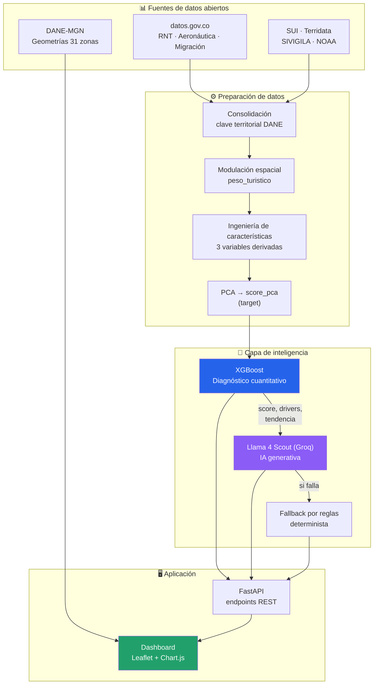
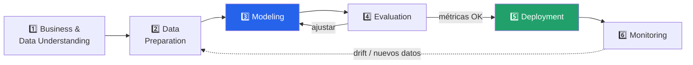
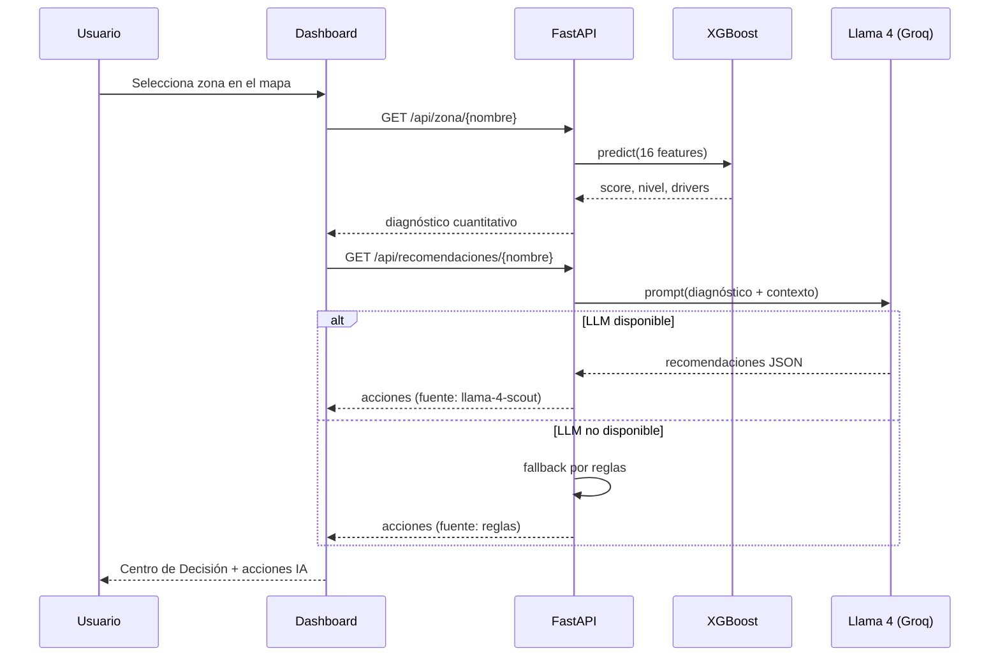
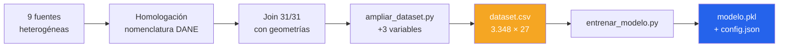

# Arquitectura y Diagramas de Flujo

---

## 1. Arquitectura general del sistema

**Arquitectura híbrida:** el XGBoost produce el **diagnóstico cuantitativo** (qué tan
presionada está cada zona y por qué); el LLM lo traduce en **acciones de política pública**.
Son dos capas de IA con funciones distintas y complementarias.

---

## 2. Flujo de trabajo — CRISP-ML

---

## 3. Flujo de inferencia (en ejecución)

**Nota de diseño:** el fallback determinista garantiza que el sistema **nunca falle** ante
una caída del proveedor de LLM — un requisito no negociable en una herramienta destinada al
sector público.

---

## 4. Pipeline de datos

---

## 5. Componentes y responsabilidades

| Componente | Archivo | Responsabilidad |
|---|---|---|
| Ingeniería de datos | `src/ampliar_dataset.py` | Deriva las 3 variables adicionales |
| Entrenamiento | `src/entrenar_modelo.py` | Entrena, valida y persiste el modelo |
| Inferencia + API | `src/api.py` | Carga el modelo, expone endpoints, integra Groq |
| Precómputo | `src/precompute.py` | Calcula el bundle completo al arrancar |
| Entrypoint | `src/app.py` | Sirve la aplicación (Gradio/HF Spaces) |
| Frontend | `src/static/` | Dashboard interactivo |

---

## 6. Stack tecnológico

| Capa | Tecnología |
|---|---|
| Modelo predictivo | XGBoost 2.1 · scikit-learn |
| IA generativa | Llama 4 Scout 17B (Groq API) |
| Backend | FastAPI · Python 3.11 |
| Frontend | Leaflet · Chart.js · HTML/CSS/JS |
| Datos geoespaciales | GeoJSON (EPSG:4326) · DANE-MGN |
| Despliegue | Hugging Face Spaces (Gradio SDK) |
